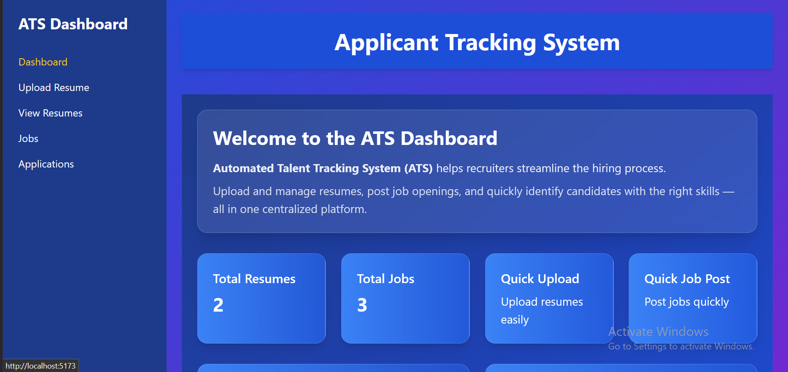
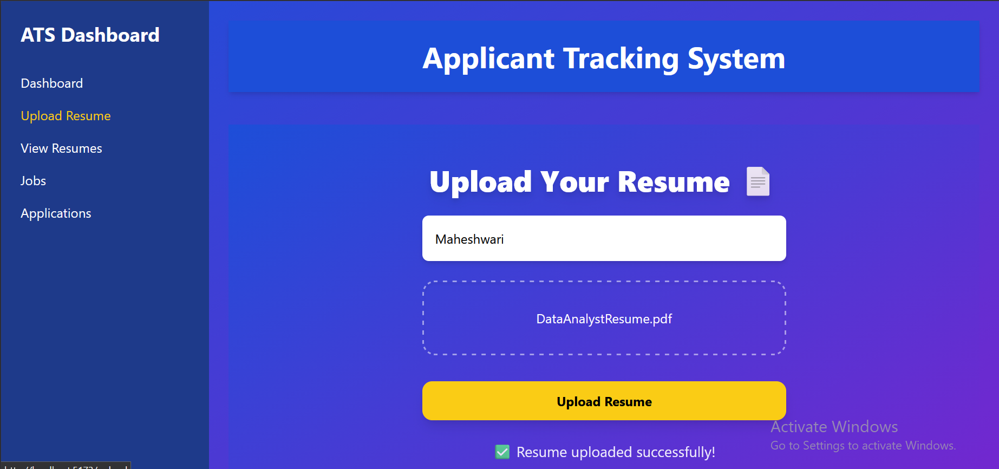
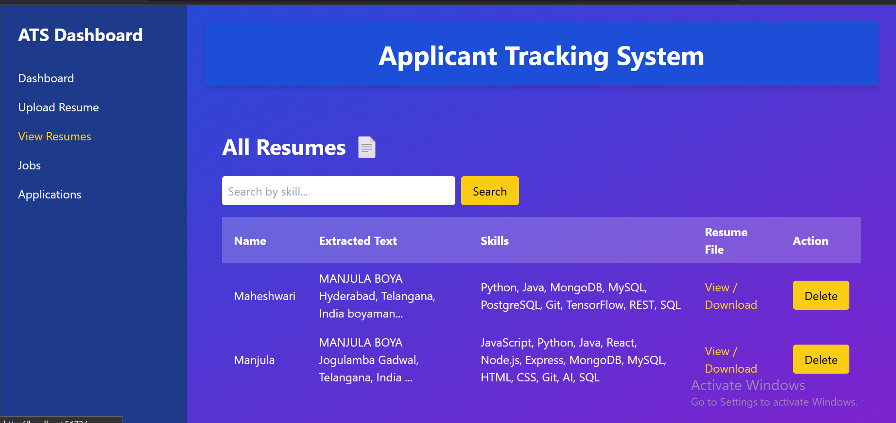
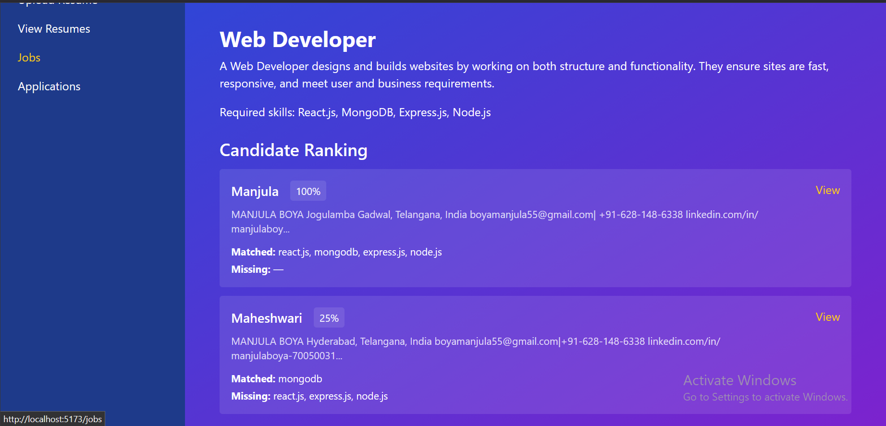
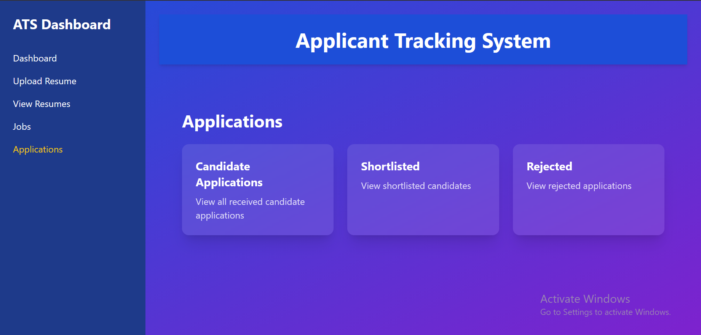
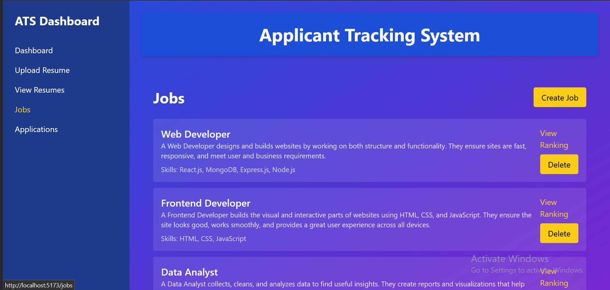

# ATS - Applicant Tracking System

 
## Project Overview
The **Applicant Tracking System (ATS)** is a web-based platform designed to streamline the hiring process. Recruiters can upload and manage resumes, post job openings, and track candidate applications efficiently.

---

## Features
- Upload and store resumes with skill extraction.
- Post and manage job openings.
- View and manage candidate applications (Pending, Reviewed, Shortlisted, Rejected).
- Automatic skill matching and scoring between resumes and job requirements.
- Professional dashboard with recent resumes and jobs overview.
- Search resumes by skills.
- Fully responsive and user-friendly interface.

---

## Screenshots

**Dashboard**


**Upload Resume**


**View Resume**


**Matching resume scores**


**Candidate Applications**


**Job Listings**


 

---

## Tech Stack
- **Frontend:** React.js, Tailwind CSS
- **Backend:** Node.js, Express.js
- **Database:** MongoDB
- **File Upload & Processing:** Multer, PDF-Parse
- **Deployment:** GitHub, Localhost

---

## Installation & Setup
1. Clone the repository:
```bash
git clone https://github.com/BoyaManjula/ATS-system-project.git

2.Navigate to backend folder and install dependencies:
cd backend
npm install

3.Setup environment variables (.env):
PORT=5000
MONGO_URI=your_mongodb_connection_string
EMAIL_USER=your_email
EMAIL_PASS=your_email_password
JWT_SECRET=your_secret_key

4.Start the backend server:
npm run dev

5.Navigate to frontend folder and install dependencies:
cd frontend
npm install

6.Start the frontend:
npm run dev
